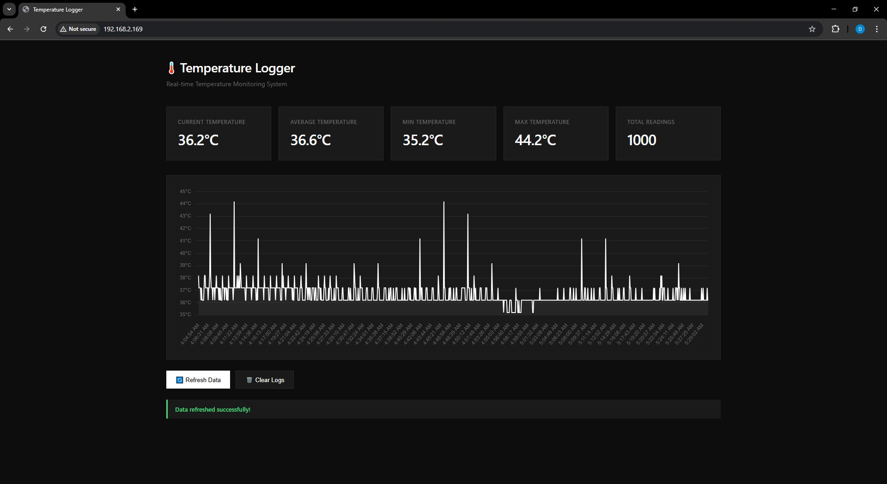
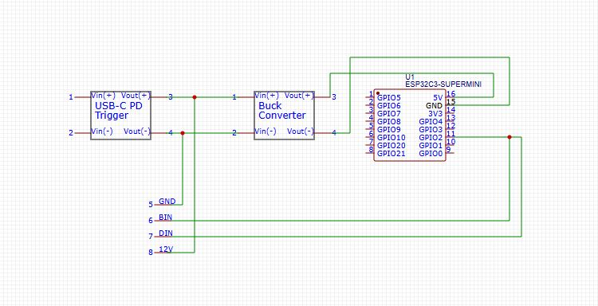
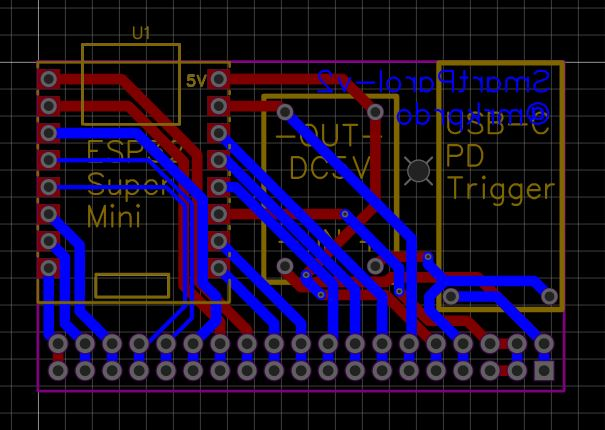
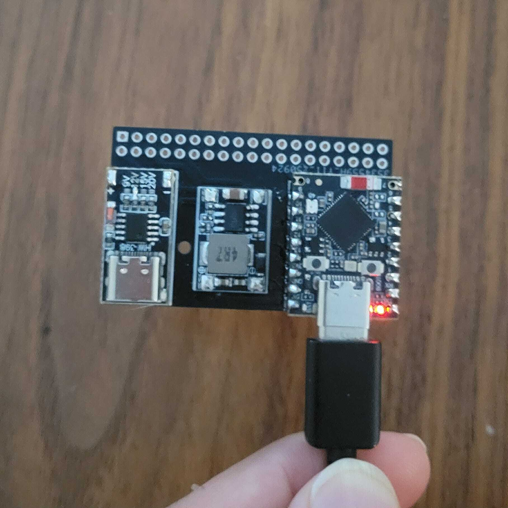

# ESP32-S3 Temperature Logger

Real-time temperature monitoring system with web dashboard and persistent data logging.

<div align="center">

</div>

## Features

| Feature                    | Description                                     |
| -------------------------- | ----------------------------------------------- |
| **Temperature Monitoring** | ESP32-S3 internal sensor, 5s sampling           |
| **Web Dashboard**          | Live Chart.js visualization with stats          |
| **WebSocket**              | Real-time updates every 2s                      |
| **Storage**                | NVS flash, up to 1000 readings, circular buffer |
| **LED Indicator**          | WS2812 RGB (Red → Green → Blue cycle)           |
| **API**                    | REST endpoints for data access                  |

## Hardware

| Component | Spec                         |
| --------- | ---------------------------- |
| **MCU**   | ESP32-S3-SUPERMINI           |
| **LED**   | WS2812 RGB (GPIO 48)         |
| **Power** | USB-C PD with buck converter |

| Schematic                                     | PCB                                    | Prototype                                    |
| --------------------------------------------- | -------------------------------------- | -------------------------------------------- |
|  |  |  |

## Quick Start

### 1. Configure WiFi

Edit `main/main.c`:

```c
#define WIFI_SSID "YourSSID"
#define WIFI_PASS "YourPassword"
```

### 2. Build and Flash

```bash
idf.py build
idf.py -p COMx flash monitor
```

### 3. Access Dashboard

Check serial monitor for IP address, then open:

```
http://<ESP32-IP>/
```

## API

| Endpoint     | Method    | Description              |
| ------------ | --------- | ------------------------ |
| `/`          | GET       | Web dashboard            |
| `/api/temp`  | GET       | Get all readings (JSON)  |
| `/api/clear` | GET       | Clear all logs           |
| `/ws`        | WebSocket | Live temperature updates |

## Configuration

Edit `main/main.c`:

| Parameter                 | Default | Description                  |
| ------------------------- | ------- | ---------------------------- |
| `WIFI_SSID` / `WIFI_PASS` | -       | WiFi credentials             |
| `LED_GPIO`                | 48      | WS2812 GPIO pin              |
| `MAX_TEMP_LOGS`           | 1000    | Max stored readings          |
| `TEMP_LOG_INTERVAL_MS`    | 5000    | Sample interval (ms)         |
| `WEBSOCKET_UPDATE_MS`     | 2000    | WebSocket push interval (ms) |

## How It Works

| Component               | Implementation                                                                                  |
| ----------------------- | ----------------------------------------------------------------------------------------------- |
| **Temperature Logging** | ESP32-S3 internal sensor → Circular buffer (1000 max) → NVS flash (auto-save every 10 readings) |
| **WS2812 LED**          | Custom RMT-based driver, precise timing (T0H=0.4µs, T1H=0.8µs), no external libraries           |
| **Web Interface**       | Embedded HTML + Chart.js + WebSocket live updates (current/avg/min/max stats)                   |

## Project Structure

```
esp32_temp_logger/
├── main/
│   ├── main.c           # Application code
│   └── www/
│       └── index.html   # Web dashboard
├── images/              # Docs
└── sdkconfig.defaults   # ESP-IDF config
```

## Requirements

- ESP-IDF v5.x
- ESP32-S3 target

## License

Provided as-is for educational purposes.
